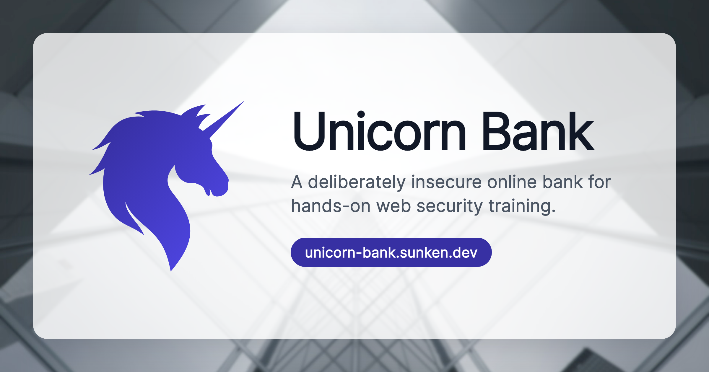

# Unicorn Bank



A deliberately insecure mock online bank for hands-on web security training. Built for a school coding day.

Sign in, find the flaws, and move the money to the offshore account. No real bank, no real money.

**Play it:** https://unicorn-bank.sunken.dev

## Run locally

It is a static site with no build step. Serve the folder with any web server:

```sh
python3 -m http.server 8000
```

Then open http://localhost:8000.

## Reset

Open `reset.html` to clear the game state and start over.

## Stack

Plain HTML and vanilla JavaScript, with Tailwind CSS prebuilt into `css/unicorn.css`. The `css/Dockerfile` rebuilds the stylesheet.

## Note

The security flaws are intentional. Please don't report them as bugs, and don't reuse this code in a real application.
