# (a) Anfänger
   1. Login Schaltfläche ist klickbar  
      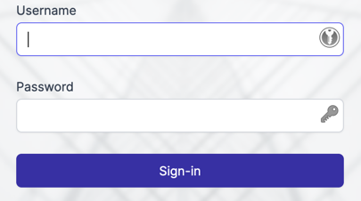
   2. TestUser kann sich anmelden  
      Username: TestUser  
      Passwort: correct horse battery staple  
   3. Falsche Login Daten zeigt Fehler mit Text an  
      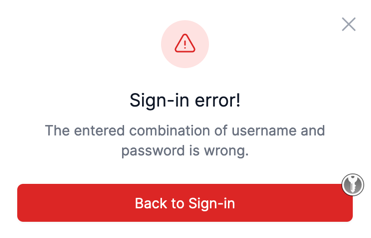  
   4. TestUser kann die Transaktion "Netflix" mit "-25,99" Euro sehen  
      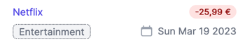  
   5. TestUser kann Geld überweisen und erhält eine Erfolgsmeldung  
      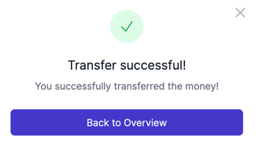  
   6. TestUser kann 100 Euro auf ein Testkonto überweisen und erhält 100 Euro zurück  
      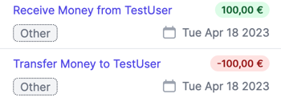

# (b) Fortgeschritten
   1. Admin kann sich anmelden  
      Username: admin  
      Passwort: adm1n  
   2. Admin kann eine rote experimentelle Schaltfläche sehen  
        
   3. TestUser sollte die rote experimentelle Schaltfläche nicht sehen  
      Jene rote Schaltfläche die der Admin ganz oben auf der Übersichtseite aller Transaktionen hat, sollte beim TestUser nicht sichtbar sein  
   4. Admin kann 100 Euro auf ein Offshore-Konto überweisen  
      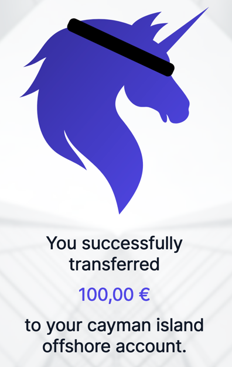  
   5. Admin sieht den korrekten Betrag auf dem Erfolgsbildschirm, nachdem er Geld auf das Offshore-Konto überwiesen hat  
      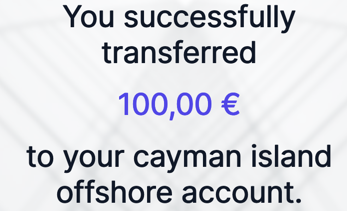  
   6. Admin kann mit der Überbeziehungsfunktion mehr Geld senden als er hat  
      Dazu muss er den experimentellen Modus aktivieren und danach mehr Geld senden als er hat  
        
      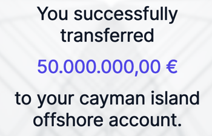  

# (c) Professional
   1. Admin sieht die korrekte Summe aller Transaktionen auf der Übersicht  
        
   2. Transaktionskategorien sind Singular, nicht Plural  
      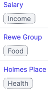  
      Income, Food und Health  
   3. Das Unicorn Bank Logo wird links oben als Bild mit einem Pferd angezeigt  
        

# (d) Experte
   1. Admin sollte eine Gebühr von 10 Euro für Offshore-Überweisungen zahlen
   - Ändern Sie die Funktionalität, um den gesendeten Betrag an das Offshore-Konto um 10 Euro zu reduzieren.
   - Passen Sie danach die Tests so an um das neue Verhalten wiederspiegeln, also nach dem senden auf ein Offshore Konto sollte der gesendete Betrag um 10 Euro weniger sein als der vom Admin eingetragene Betrag
   - Beispiel 
      - Admin sendet 1000 Euro an Offshore Konto
      - Es werden am Erfolgsbildschirm lediglich 990 Euro angezeigt, weil ja 10 Euro Gebühr sind die nur für den Admin anfallen
   - Tipp: Test b4
   - 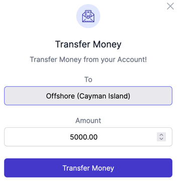
   - 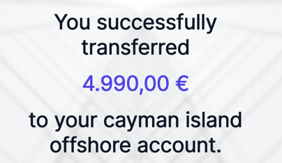